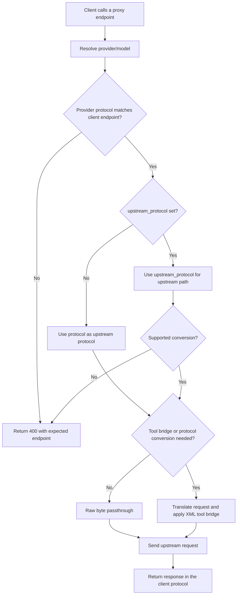

# LLMToolWhisper

[](https://github.com/starlight02/llm-tool-whisper/actions/workflows/docker.yml)

`LLMToolWhisper` is a transparent Rust proxy that lets upstream models without
native tool calling participate in the OpenAI / Anthropic tool protocols.

The client still owns tools. The proxy does not configure tools, execute tools,
or call tool backends. It only bridges representations:

1. the client sends normal tool definitions in its request
2. the proxy explains those client-provided tools to the upstream model as XML
3. the upstream model emits one or more `<tool_call>...</tool_call>` blocks
4. the proxy converts those XML blocks into the current protocol's native
   tool-call response, with single or parallel calls
5. the client executes the tools and sends the normal tool result(s) back
6. the proxy converts those tool results into XML for the upstream model

Requests without tools are forwarded with the original body bytes when the
client protocol and upstream protocol match. If a provider sets
`upstream_protocol`, the proxy translates the request and response between the
client-facing protocol and the upstream protocol.

## API

Configured providers declare exactly one client-facing protocol:

- `chat`: `POST /v1/chat/completions`
- `responses`: `POST /v1/responses`
- `messages`: `POST /v1/messages`

`protocol` controls which proxy endpoint accepts the provider. It does not
change when `upstream_protocol` is set. A provider with `protocol = "messages"`
only accepts `/v1/messages` client requests.

`upstream_protocol` controls only the upstream path. It defaults to `protocol`.
The supported cross-protocol path is `messages` clients to a `chat` upstream.
Other cross-protocol combinations return `400`.

`GET /v1/models` returns configured models in OpenAI list format. Model ids are
exposed as:

```text
provider/model
```

`GET /health` returns `{"ok": true}` for liveness probes.

## Request flow

The proxy keeps the client-facing protocol stable, then chooses the upstream
path after provider resolution.



## Configuration

Configuration is TOML only.

```toml
[server]
bind = "127.0.0.1:8787"
# Maximum request body size in megabytes (default 32).
body_limit_mb = 32

[log]
level = "info"

[upstream]
# Cap on establishing the TCP/TLS connection to the upstream.
connect_timeout_secs = 20
# End-to-end cap for one non-streaming upstream turn. Streaming turns
# are not bounded by this. They run as long as the client SSE.
json_total_timeout_secs = 300
# SSE keepalive comment frame interval. Keep below the idle timeout of
# any load balancer fronting this proxy.
sse_keepalive_secs = 15

[[providers]]
name = "openai"
protocol = "chat"
base_url = "https://api.openai.com/v1"
api_key = "your_openai_api_key_here"
models = ["gpt-4.1", "gpt-4.1-mini"]

[[providers]]
name = "anthropic"
protocol = "messages"
base_url = "https://api.anthropic.com/v1"
api_key = "your_anthropic_api_key_here"
auth_header = "x-api-key"
auth_scheme = ""
headers = { "anthropic-version" = "2023-06-01" }
# Default: true. Set false for upstreams that already accept native tools.
bridge_tools = true
models = [
  "claude-fable-5",
  "claude-opus-4-8",
  "claude-sonnet-4-6",
  "claude-haiku-4-5",
]

[[providers]]
name = "messages-via-chat"
protocol = "messages"
upstream_protocol = "chat"
base_url = "https://api.example.com/v1"
api_key = "your_provider_api_key_here"
bridge_tools = true
models = ["example-chat-model"]
```

Provider auth is a default. If the client already sends the same header, the
client header wins. This lets the proxy run with configured credentials while
still allowing per-request overrides.

`bridge_tools` controls whether tool requests are translated into XML prompt
instructions. Keep the default `true` for upstreams without native tool support.
Set it to `false` for upstreams that already accept the request protocol's
native `tools` field; those requests are then passed through with only the
provider-prefixed model id rewritten to the bare upstream model id.

For `protocol = "messages"` plus `upstream_protocol = "chat"`, keep
`bridge_tools = true`. That conversion uses XML tool bridge and does not pass
native Chat tool calls through.

`upstream_protocol` is optional and defaults to `protocol`. Same-protocol
providers can use `chat`, `responses`, or `messages`. Cross-protocol conversion
is implemented for `protocol = "messages"` plus `upstream_protocol = "chat"`:
clients call `/v1/messages`, the proxy sends `POST /v1/chat/completions`
upstream, and the response is converted back to Messages format.

For Anthropic Messages requests, the client request body still needs the normal
Anthropic fields such as `max_tokens` and `messages`; the proxy does not inject
them.

## Run

```bash
cp config.example.toml config.toml
cargo run --release -- config.toml
```

If no path is passed, the proxy reads `config.toml`.

## Docker

Prebuilt multi-arch images (amd64 + arm64) are published to GHCR on every push
to `main`/`master` (tagged `latest`) and on every `v*` git tag (tagged with that
version, e.g. `v0.1.0`).

```bash
cp config.example.toml config.toml
docker run --rm -p 8787:8787 \
  -v "$PWD/config.toml:/etc/llm-tool-whisper/config.toml:ro" \
  ghcr.io/starlight02/llm-tool-whisper:latest
```

Compose pulls the prebuilt image. No local build is needed:

```bash
cp config.example.toml config.toml
docker compose up -d
docker compose logs -f
```

To pin a release, set the image tag in `docker-compose.yml` or `docker run` with
`ghcr.io/starlight02/llm-tool-whisper:v0.1.0`.

### Building locally

If you need a locally-built image (offline, custom patch, …):

```bash
docker build -t llm-tool-whisper .
docker run --rm -p 8787:8787 \
  -v "$PWD/config.toml:/etc/llm-tool-whisper/config.toml:ro" \
  llm-tool-whisper
```

### CI

Image builds are driven by `.github/workflows/docker.yml`. The job:

1. Checks out the repo.
2. Sets up Docker Buildx + QEMU for multi-arch emulation.
3. Logs in to GHCR using the auto-provisioned `GITHUB_TOKEN`.
4. Builds and pushes `linux/amd64,linux/arm64` with the right tags
   (`latest` on `main`/`master`, `vX.Y.Z` + major on `v*` tags, and the short
   SHA on every build for traceability).

No secrets need configuration. GitHub Actions provides the `GITHUB_TOKEN` with
`packages: write`.

## Tool Bridge

The upstream model is instructed to emit each tool call in its own XML block:

```xml
<tool_call>
  <name>tool_name</name>
  <arguments><![CDATA[{"key":"value"}]]></arguments>
</tool_call>
```

The model may emit several `<tool_call>` blocks back-to-back in one turn for
parallel work; the proxy collects every block in source order.

The proxy converts XML blocks into native tool calls for the request protocol:

- Chat Completions: `choices[0].message.tool_calls` (array)
- Responses: each call is one `output[].type = "function_call"` item
- Messages: each call is one `content[].type = "tool_use"` block

When the client sends tool results back, the proxy converts those result
messages into:

```xml
<tool_result>
  <name>tool_name</name>
  <content><![CDATA[{"ok":true,"content":"result"}]]></content>
</tool_result>
```

Then it forwards the request to the configured upstream protocol. Any extra
metadata the client attached to the result (`stdout`, `stderr`, `exit_code`,
`status`, `citations`, `usage`, and other fields) is preserved inside the
payload, so the upstream model receives the full side-channel context.

### Robustness

The bridge handles several real-world failure modes:

- Tool arguments that contain the literal `]]>` sequence are split across two
  CDATA sections, so payloads never accidentally close the wrapper.
- Visible prose that precedes or surrounds the `<tool_call>` blocks is
  forwarded to the client alongside the synthesized tool calls (Chat
  `message.content`, Responses `output[].message`, Messages `content[].text`).
- A leaked `Thinking...\n> ...` preamble is lifted into the protocol's
  reasoning surface (Chat `reasoning_content`, Responses `reasoning` item,
  Messages `thinking` block) and is never dropped silently.
- Streaming responses scan for `<tool_call>` markers without leaking partial
  XML to the client, and emit native tool-call SSE chunks once a complete
  block is in.
- Argument aliases (`cmd` → `command`, `q` → `query`, `file` → `path`, …) are
  rewritten only when the tool's declared schema accepts the canonical name
  and does not declare the alias as a distinct property.

## Performance

- No-tool requests use raw byte passthrough only when `protocol` and
  `upstream_protocol` match.
- Cross-protocol requests and tool-bridged requests serialize JSON before the
  upstream request.
- Two long-lived `reqwest` clients (one for streaming, one with a 5-minute
  total cap for JSON turns) reuse upstream connections.
- Tool requests make one upstream request per client request. Tool execution
  and multi-step orchestration stay in the client.
